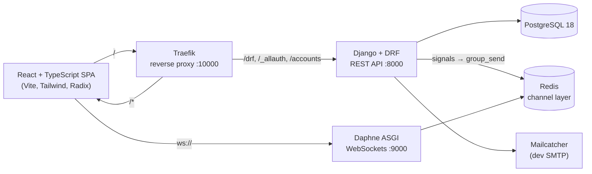

# FragranceFindr

**A community-maintained fragrance database with a moderated research pipeline, multi-axis ratings, and real-time notifications.**

Django · Django REST Framework · Django Channels · React · TypeScript · PostgreSQL · Redis · Docker

> **Status:** Active development. The core platform (auth, catalog, research pipeline, ratings, collections, notifications) is implemented and runs locally via Docker Compose. Not yet publicly deployed. See [Roadmap](#roadmap).

---

## Why this exists

Fragrance information online is fragmented, inconsistent, and frequently wrong. Notes get copied between sites without verification, release years drift, and discontinued scents are listed as available for years. FragranceFindr treats fragrance data like a wiki with an editorial process: anyone can propose a new entry or an edit, but nothing enters the catalog until it has cited sources and reviewer approval.

The result is a database that grows through collaboration while staying accurate, wrapped in the community features (ratings, reviews, collections) that make people want to contribute.

---

## Features

### Research pipeline (the core of the project)
- **Proposals** — users submit new fragrances with brand, house, perfumers, bottle designers, note pyramid, release year, concentration variants, and supporting sources
- **Field-level edit revisions** — an `EditedPerfume` model captures proposed changes to an existing entry as a diff against the original, so reviewers see exactly what changed
- **Source verification checklists** — each cited source carries per-field confirmation checklists (notes, release year, availability) that multiple reviewers can independently sign off on
- **Reviewer workflow** — pending / confirmed / rejected states with attribution of who confirmed or rejected each entry, plus per-proposal discussion threads
- **Role-gated routes** — research auditing is restricted to authorized users on both the API and the React router

### Community
- **Five-axis ratings** — scent, sillage, longevity, bottle, and price, each on a decimal scale, with per-fragrance aggregation and rating-distribution charts
- **Reviews and statements** — long-form reviews and short "statements" with scent associations, upvotes/downvotes, and awards
- **Classifications** — crowd-sourced occasion, season, style, and type tags per fragrance
- **Collections** — six built-in shelves (currently own, owned before, wish list, watching, tested, decants) plus unlimited custom collections with icons
- **Subscriptions** — follow a fragrance for new reviews, statements, or photos
- **Profiles and progression** — XP-based leveling with per-level profile colors, badges, and custom avatars with in-browser cropping

### Real-time notifications
- WebSocket delivery via **Django Channels** with a **Redis** channel layer
- Per-user channel groups; notifications fire from `post_save` and `m2m_changed` signals on reviews, votes, and subscriptions
- **Actor aggregation** — multiple actions on the same target collapse into one notification ("A, B and 3 others liked your review") via a `NotificationActor` through-table

### Authentication
- **django-allauth headless** API consumed by the React SPA
- Email verification (link or code), passwordless login by code, password reset
- **MFA:** TOTP, WebAuthn/passkeys (including passkey-only login), recovery codes
- Google OAuth and Google One Tap
- Session management with device listing and remote logout

---

## Architecture



**Backend** is organized into Django apps by domain:

| App | Responsibility |
|---|---|
| `accounts` | Custom `User` model, `UserProfile`, allauth adapters |
| `database` | Catalog models (28 total across the project), ratings, reviews, statements, collections, classifications |
| `research` | Proposals, edit revisions, sources, verification checklists, discussions |
| `notifications` | Notification models, signal handlers, WebSocket consumer |
| `profiles` | Badges, XP thresholds, leveling |

**Frontend** mirrors that structure under `frontend/src/` (`research/`, `database/`, `collections/`, `profile/`, `account/`, `mfa/`), with shared UI primitives in `components/` and a typed API client in `lib/`.

~90 REST endpoints, 47 client routes.

---

## Tech stack

| Layer | Choices |
|---|---|
| Backend | Python 3.12, Django, Django REST Framework, Django Channels, django-allauth (headless, MFA, social) |
| Frontend | React 18, TypeScript, Vite, React Router 6, Tailwind CSS, Radix UI, Recharts, Framer Motion |
| Data | PostgreSQL 18 (with `ArrayField` and `JSONField` for note pyramids and tag sets), Redis |
| Infra | Docker Compose, Traefik, Daphne, Mailcatcher |
| Testing | Playwright end-to-end spec for the auth flows |

---

## Running locally

Requires Docker and Docker Compose.

```bash
git clone https://github.com/Christopher-Staffieri/FragranceFindrPublic.git
cd FragranceFindrPublic
docker compose up --build
```

Then open **http://localhost:10000**.

- API: `http://localhost:8000`
- Mailcatcher (verification emails land here): `http://localhost:1080`
- Postgres is exposed on `5433` for local inspection

Migrations run automatically when the backend container starts. To open a Django shell:

```bash
make shell
```

### Optional: Google sign-in
Create an OAuth client in Google Cloud Console and add the credentials to `backend/backend/local_settings.py` (git-ignored, loaded automatically if present):

```python
SOCIALACCOUNT_PROVIDERS = {
    "google": {
        "APP": {"client_id": "...", "secret": "..."},
        "SCOPE": ["profile", "email"],
    }
}
```

---

## Project structure

```
.
├── backend/
│   ├── backend/
│   │   ├── accounts/        # user model, profile, allauth adapters
│   │   ├── database/        # catalog, ratings, reviews, collections
│   │   ├── research/        # proposals, edits, sources, checklists
│   │   ├── notifications/   # models, signals, websocket consumer
│   │   ├── profiles/        # badges, leveling
│   │   ├── settings.py
│   │   ├── urls.py
│   │   └── asgi.py / routing.py
│   ├── Dockerfile
│   └── requirements.txt
├── frontend/
│   ├── src/
│   │   ├── research/        # propose, review, audit UI
│   │   ├── database/        # fragrance detail, lists, rating forms
│   │   ├── collections/
│   │   ├── profile/
│   │   ├── account/ mfa/    # auth flows
│   │   ├── components/      # shared UI
│   │   ├── hooks/
│   │   └── lib/             # typed API client
│   └── Dockerfile
├── docker-compose.yml
├── traefik.toml
└── e2e.spec.js
```

---

## Roadmap

Ordered by what I'd tackle next:

1. **Permission hardening** — move all authorization checks to `request.user` with `IsAuthenticated` / object-level permissions, replacing client-supplied user IDs
2. **Test suite** — unit tests for the research pipeline state machine and notification signals, expanding the existing Playwright coverage beyond auth
3. **Schema cleanup** — consolidate the proposal status tables into a single choices field; correct several `OneToOneField` relations that should be `ForeignKey`
4. **Production configuration** — environment-based settings, `DEBUG=False`, locked-down CORS, migrations committed rather than generated at container start
5. **Search** — PostgreSQL full-text search across fragrances, notes, and houses
6. **Public deployment**
7. Blog and forum sections

---

## Acknowledgements

The authentication frontend (`frontend/src/account`, `frontend/src/mfa`, `frontend/src/lib/allauth.ts`) and the Traefik/Mailcatcher development harness are adapted from the [django-allauth React SPA example](https://github.com/pennersr/django-allauth/tree/main/examples/react-spa), extended with the project's custom user model, headless adapter, and UI.

---

## Author

**Christopher Staffieri** — B.S. Computer Science, Stevens Institute of Technology (expected 2029)
[GitHub](https://github.com/Christopher-Staffieri) · [LinkedIn](https://www.linkedin.com/in/christopher-staffieri-29b16a352/)
